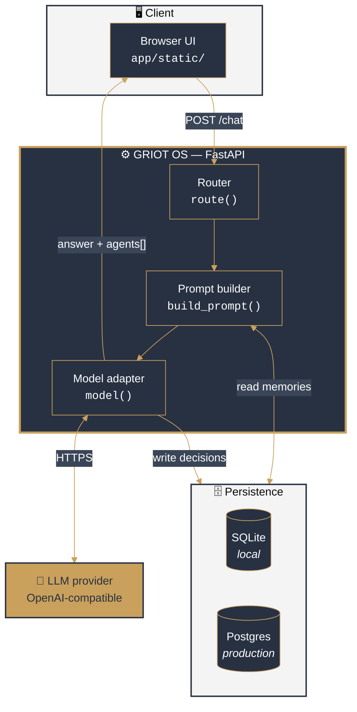
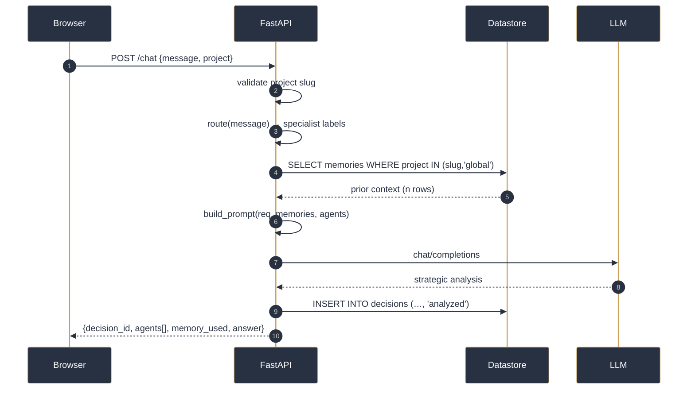
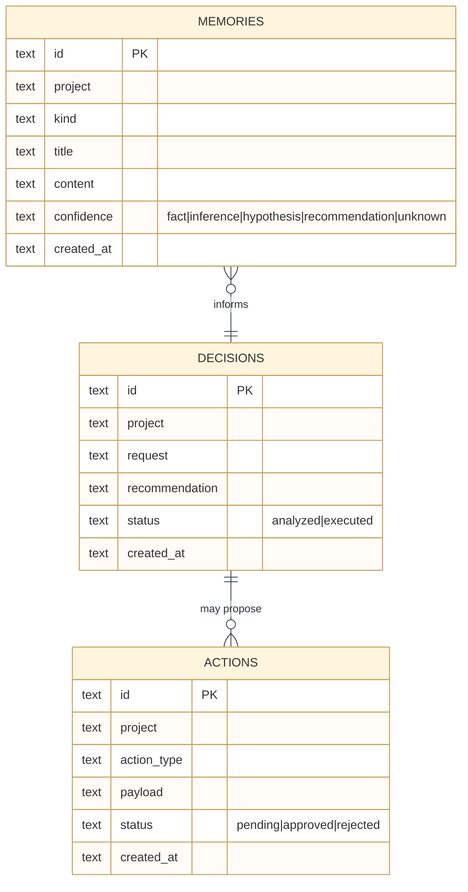
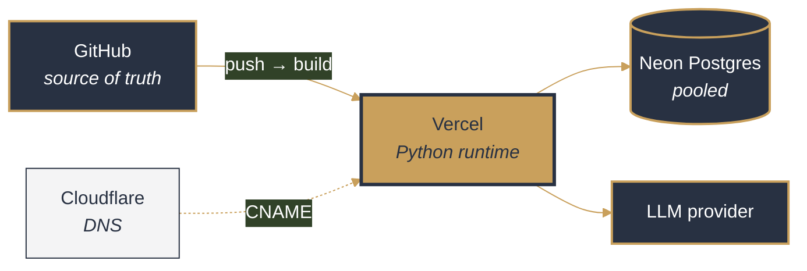
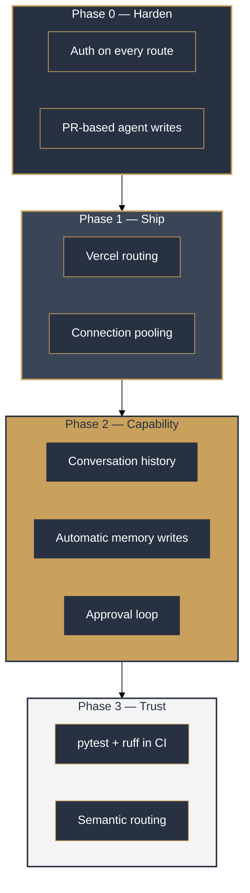

<div align="center">


# GRIOT OS

**Strategic intelligence & execution agent for a multi-venture portfolio**

*Think like a strategist. Validate like a data scientist. Build like a software engineer.*<br/>
*Communicate like a storyteller. Operate like an owner.*

<br/>


<br/>


</div>

---

## Table of contents

- [Why this exists](#why-this-exists)
- [System architecture](#system-architecture)
- [Request lifecycle](#request-lifecycle)
- [The decision protocol](#the-decision-protocol)
- [Data model](#data-model)
- [Implementation status](#implementation-status)
- [Quickstart](#quickstart)
- [API surface](#api-surface)
- [Deployment topology](#deployment-topology)
- [Security posture](#security-posture)
- [Roadmap](#roadmap)

---

## Why this exists

Generic assistants answer questions. They do not hold **portfolio context**, they do not
**separate evidence from assumption**, and they forget every decision the moment the tab closes.

GRIOT OS is an attempt to fix all three for one specific operator working across six ventures —
SpeakPower, Tonninyira, CuePointe, UBF, FoB and adjacent work.

The design bet is that the valuable part of an AI operating system is not the chat box.
It is the **memory**, the **evidence discipline**, and the **decision log**.

> Never confuse activity with progress.

---

## System architecture

Two independent subsystems share this repository. They share no code.



The persistence layer is selected at runtime: `DATABASE_URL` present → Postgres, otherwise SQLite.
The application code is storage-agnostic above that boundary.

---

## Request lifecycle

What actually happens on a single `POST /chat`:



Every request produces a **durable `decision_id`**. Analysis is not ephemeral —
it is an auditable record keyed to a project.

---

## The decision protocol

Requests are reasoned through nine stages rather than answered directly:

```mermaid
%%{init: {'theme':'base','themeVariables':{'primaryColor':'#283142','primaryTextColor':'#ffffff','primaryBorderColor':'#C9A05C','lineColor':'#C9A05C','fontFamily':'ui-sans-serif, system-ui, sans-serif'}}}%%
flowchart LR
    U(["UNDERSTAND"]) --> C(["CONTEXT"]) --> E(["EVIDENCE"]) --> D(["DIAGNOSE"])
    D --> O(["OPTIONS"]) --> R(["RECOMMEND"]) --> X(["EXECUTE"])
    X --> M(["MEASURE"]) --> L(["LEARN"])
    L -.->|"feeds memory"| E

    style U fill:#283142,color:#fff,stroke:#C9A05C
    style C fill:#283142,color:#fff,stroke:#C9A05C
    style E fill:#283142,color:#fff,stroke:#C9A05C
    style D fill:#283142,color:#fff,stroke:#C9A05C
    style O fill:#283142,color:#fff,stroke:#C9A05C
    style R fill:#C9A05C,color:#283142,stroke:#283142,stroke-width:3px
    style X fill:#283142,color:#fff,stroke:#C9A05C
    style M fill:#283142,color:#fff,stroke:#C9A05C
    style L fill:#C9A05C,color:#283142,stroke:#283142,stroke-width:3px
```



Claims are tagged by epistemic status so assumptions never masquerade as evidence:

| Tag | Meaning |
|:--|:--|
| `FACT` | Verifiable, sourced |
| `INFERENCE` | Derived from facts, logically supported |
| `HYPOTHESIS` | Plausible, untested |
| `RECOMMENDATION` | A judgment call, owned as such |
| `UNKNOWN` | Explicitly not known — stated, not skipped |

---

## Data model



Schema of record is `SCHEMA_SQL` in [`griot-os/app/main.py`](griot-os/app/main.py).
Identical DDL runs against both SQLite and Postgres.

---

## Implementation status

Honest accounting. This is an alpha — the architecture above is the target, and not all of it is wired.

| Capability | Status | Notes |
|:--|:--:|:--|
| FastAPI service, health, OpenAPI | ✅ | Runs clean, `/docs` live |
| Project-scoped routing | ✅ | Keyword classifier → specialist labels |
| SQLite + Postgres dual backend | ✅ | Runtime-selected on `DATABASE_URL` |
| Decision logging | ✅ | Every `/chat` persists a `decision_id` |
| Browser UI | ✅ | Zero-dependency vanilla JS |
| Memory read into prompt | ✅ | Manual writes via `POST /memory` |
| Model reasoning | ⚠️ | Requires a valid `OPENAI_MODEL`; ships without one |
| Automatic memory writes | ❌ | `LEARN` not yet persisted — see [Roadmap](#roadmap) |
| Conversation history | ❌ | `/chat` is stateless single-shot |
| Approval gate (`/approval`) | ❌ | Endpoint exists; no producer writes `actions` |
| Operating modes | ❌ | `mode` accepted, not yet dispatched |
| Tool use / web research | ❌ | No tool layer yet |
| Auth | ❌ | **Do not deploy publicly.** See [Security](#security-posture) |

Legend: ✅ shipped · ⚠️ partial · ❌ designed, not built

---

## Quickstart

```bash
git clone https://github.com/SpeakPower-commits/claude-central-agent.git
cd claude-central-agent/griot-os

python3 -m venv .venv && source .venv/bin/activate   # Windows: .venv\Scripts\activate
pip install -r requirements.txt

cp .env.example .env    # then set OPENAI_API_KEY and a valid OPENAI_MODEL
python3 -m uvicorn app.main:app --reload
```

| Surface | URL |
|:--|:--|
| Web interface | http://127.0.0.1:8000 |
| OpenAPI docs | http://127.0.0.1:8000/docs |
| Health probe | http://127.0.0.1:8000/health |

> **Note** — without `OPENAI_API_KEY` the service still boots and exercises routing,
> memory and persistence in *orchestration-only mode*. Useful for testing the pipeline
> without spending tokens.

---

## API surface

| Method | Path | Purpose |
|:--|:--|:--|
| `GET` | `/health` | Liveness + active memory backend |
| `GET` | `/projects` | Registered project slugs |
| `GET` | `/agents` | Specialist roster |
| `GET` | `/memories?project=` | Recent memory, project + global scope |
| `POST` | `/memory` | Persist a memory with a confidence tag |
| `POST` | `/chat` | Full decision-protocol pass |
| `POST` | `/approval` | Resolve a pending action *(see status table)* |

```bash
curl -s -X POST localhost:8000/chat \
  -H 'Content-Type: application/json' \
  -d '{"message":"Registrations rise, orders flat. Diagnose the bottleneck.",
       "project":"tonninyira"}' | jq
```

---

## Deployment topology



No vendor owns more than one layer. Postgres is **mandatory** in production —
serverless filesystems are read-only, so the SQLite fallback cannot persist there.
Use Neon's **pooled** connection string.

Full checklist: [`griot-os/docs/GRIOT_OS_DEPLOYMENT.md`](griot-os/docs/GRIOT_OS_DEPLOYMENT.md)

---

## Security posture

This repository holds automation that can write to other repositories. Treat it accordingly.

- **No authentication is implemented yet.** Every endpoint is open. Do not expose a public deployment until an auth layer lands.
- **Never commit credentials.** `.gitignore` covers `.env` and `*.db`; secrets belong in env vars or GitHub Secrets.
- **Agent writes go through pull requests.** No automation should commit directly to a default branch.
- **CI triggers must not accept untrusted input.** Workflows holding a cross-repo token must never interpolate arbitrary user text into a prompt.
- **Least privilege.** Scope tokens to the specific repositories they need.

Agent-facing engineering rules: [`AGENTS.md`](AGENTS.md) · Persona and tone: [`CLAUDE.md`](CLAUDE.md)

---

## Roadmap



---

<div align="center">

<sub>Built by **Thomas Otieno** · SpeakPower</sub><br/>
<sub><i>Articulate is key.</i></sub>

</div>
